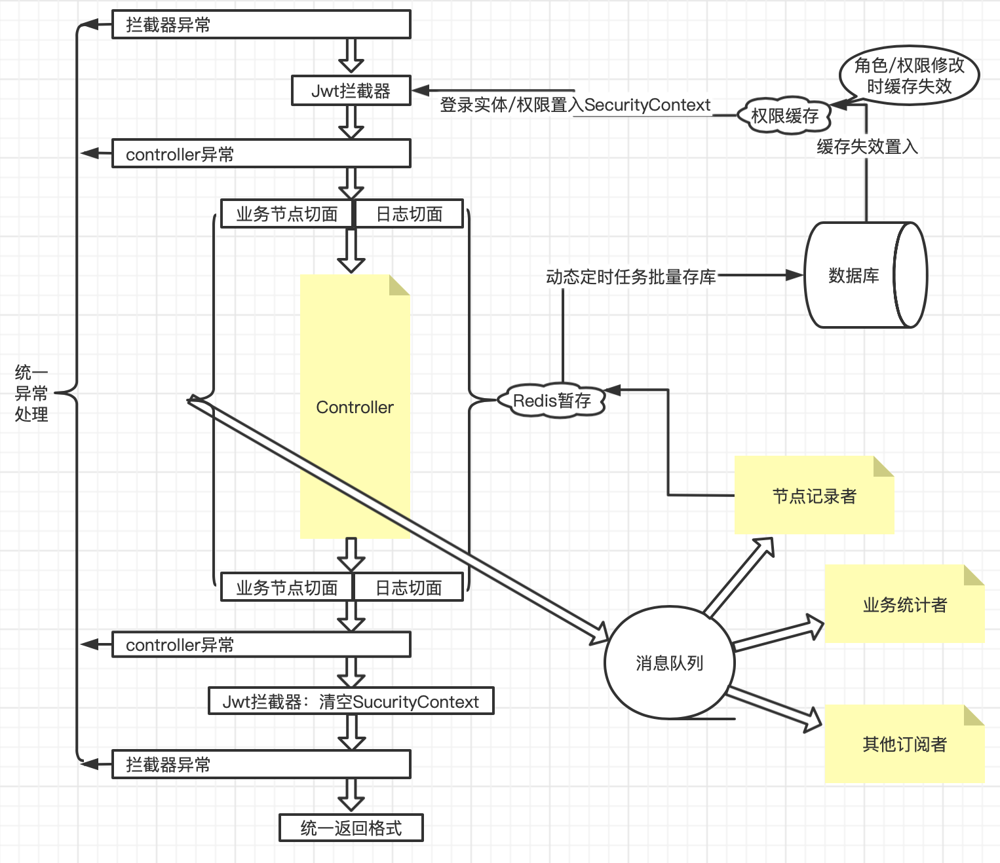

# springboot样例

```text
一个空架子，常用组件的组合示例。主要参考自https://springdoc.cn/spring-boot
```

### 目前整合内容

```text
· active-artemis 消息队列
· mail + freemarker 邮件发送
· spring-security + jwt 鉴权
· spring-cache + redis 缓存
· quartz 动态定时任务
· mybatis-plus 使用、生成代码
· p6spy SQL耗时打印
· dynamic-datasource + druid 动态数据源、管理
· knife4j-swagger 文档
```

### 待整理

- [ ] xml自定义解析
- [ ] hl7字符串拼装
- [ ] websocket聊天室
- [ ] maven自定义打包结构
- [ ] 动态路由
- [ ] 文件管理（数据库文件表设计
- [ ] excel：jxls模版 / 自定义注解向前端表达表格结构

### 整体架构图



### 外部组件

#### mysql

```shell
docker run -d \
  -p 3310:3306 \
  -e MYSQL_ROOT_PASSWORD=123456 \    
  --name mysql57 mysql:5.7;
```

```sql
-- 创建数据库并修改配置文件中的数据源连接地址
CREATE DATABASE IF NOT EXISTS `springboot-demo` DEFAULT CHARSET = utf8mb4 COLLATE utf8mb4_unicode_ci;
```

```shell
# 进入docker修改时区后重启docker
echo "default-time_zone = '+8:00'" >> /etc/mysql/mysql.conf.d/mysqld.cnf
```

#### redis

```shell
docker run -d \
-p 6380:6379 \
--name redis redis:3.2.9;
```

#### activemq。映射为宿主机8170和61620端口。8170和用户名密码是用于网页管理端的。密码不能有特殊字符

（此例代码用的SpringBoot嵌入的Artemis）

```shell
docker run -d \
-p 8170:8161 \
-p 61620:61616 \
-e ACTIVEMQ_ADMIN_LOGIN=root \
-e ACTIVEMQ_ADMIN_PASSWORD=123456 \
--name activemq5 webcenter/activemq:5.14.3;
```

#### SQL优化器

```shell
docker run -d \
-p 5077:5077 \
--name soar-web becivells/soar-web;
```